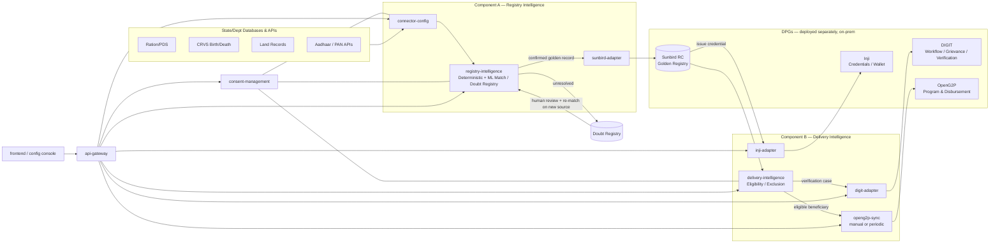

# Social Registry & Delivery of Benefits Platform

A configurable, ML-driven platform for building a **Citizen Social Registry** (golden-record identity resolution across fragmented government databases) and **Delivery of Benefits & Services** (eligibility, exclusion, and disbursement), designed for on-premise, single-tenant deployment per client (state/country).

The platform does **not** reimplement identity, credentialing, or payment infrastructure that Digital Public Goods (DPGs) already provide. It orchestrates them and contributes the two pieces no DPG provides out of the box: **entity-resolution intelligence** for the registry, and **eligibility/exclusion intelligence** for delivery.

## Design principles

1. **Configuration over code** — onboarding a new source database is a config change (schema mapping, connection details, refresh cadence), not a new integration project.
2. **Golden Registry + Doubt Registry, both permanent** — every new source is matched against both. A "doubt" record is never a dead end; it is re-attempted on every subsequent onboarding run and is only ever resolved by a **human in the loop**.
3. **Base ML model + per-client fine-tuning** — a single entity-resolution model ships pre-trained on generalizable matching features (name, DOB, address, family-graph similarity). It improves per deployment using that client's own deterministic matches (Aadhaar-confirmed pairs, etc.) as weak labels, plus human-resolved doubt records as strong labels. No client's data is required to get a working model on day one.
4. **DPGs as pluggable adapters, not forks** — Sunbird RC (registry), Inji (verifiable credentials/wallet), OpenG2P (program & disbursement), DIGIT (workflow/grievance/verification) are integrated via their APIs and run as their own services. This platform never forks them.
5. **On-prem, microservices, API-first** — every component below is an independently deployable service communicating over HTTP APIs, orchestrated via Docker Compose (this repo) or Kubernetes (client-specific overlay, not included here).
6. **Single-tenant per installation** — no cross-client data isolation logic; each deployment is a dedicated instance for one client.

## Component map

### Component A — Building the Registry ("Registry Intelligence")

| Service | Responsibility |
|---|---|
| `connector-config` | No-code source onboarding: register a DB/API/flat-file source, map its fields to the canonical citizen/family schema, set refresh cadence. Drives a generic ingestion engine — no bespoke code per source. |
| `registry-intelligence` | Data standardization, entity resolution (deterministic hard-ID matching + a trained ML model scoring name/DOB/address similarity — see `app/matching/`), classification (Unique+Complete / Unique+Incomplete / Complete+Not-unique / Neither), and the **Doubt Registry** — the queue of unresolved records with full evidence trail, resolved only by human review. Persisted (SQLite/SQLAlchemy). |
| `sunbird-adapter` | Thin adapter between `registry-intelligence`'s confirmed golden records and a **separately deployed Sunbird RC** instance. Kept as its own service so the registry backend (Sunbird RC today) can be swapped without touching matching logic. |

### Component B — Delivery of Benefits ("Delivery Intelligence")

| Service | Responsibility |
|---|---|
| `delivery-intelligence` | Eligibility scoring against scheme rules, inclusion/exclusion logic (duplicate beneficiary, asset/income thresholds), and case creation for on-ground verification (routed to DIGIT) when a Doubt Registry record blocks a benefit decision. Persisted. |
| `openg2p-sync` | One-way sync of confirmed eligible beneficiaries into a **separately deployed OpenG2P** instance for program enrollment and disbursement. Sync is **manually triggerable or scheduled (periodic)** — deliberately not a live link, so OpenG2P can run with its own local copy for resilience. |
| `digit-adapter` | Routes Doubt Registry verification cases to a **separately deployed DIGIT** instance's workflow engine (`egov-workflow-v2`) for field-agent verification, using DIGIT's real `RequestInfo`/process-transition API shape. |
| `inji-adapter` | Issues portable, verifiable credentials for a confirmed golden record via a **separately deployed Inji Certify** (OpenID4VCI, discovery-based issuance) and verifies presented credentials via **Inji Verify**. |

### Cross-cutting

| Service | Responsibility |
|---|---|
| `consent-management` | DPDP Act–aligned consent capture, purpose limitation, revocation, and audit trail for every data-sharing action between a source system, the registry, and delivery. |
| `api-gateway` | Single entry point routing `/api/<service>/*` to each backend microservice; where the frontend and any external caller connect. Optional shared-secret auth (`GATEWAY_API_KEY`) for machine-to-machine callers — see `services/api-gateway/README.md` for why that's not yet suitable for the frontend itself. |
| `frontend` | Configuration console — the operator-facing UI for connectors, registry/doubt-registry review, consent, delivery rules, and OpenG2P sync triggers. |

## Architecture



## Repository layout

```
socialregistrymine/
├── docker-compose.yml          # local/on-prem orchestration of this repo's services
├── services/
│   ├── consent-management/     # DPDP consent capture & audit — persisted, tested
│   ├── connector-config/       # source onboarding config API — persisted, tested
│   ├── registry-intelligence/  # matching engine + Golden/Doubt registry — persisted, tested,
│   │                           #   includes app/matching/ (trained ML entity-resolution model)
│   ├── delivery-intelligence/  # eligibility/exclusion engine — persisted, tested
│   ├── openg2p-sync/           # manual/periodic sync trigger to OpenG2P
│   ├── sunbird-adapter/        # adapter to a separately-deployed Sunbird RC
│   ├── digit-adapter/          # adapter to a separately-deployed DIGIT (workflow/verification)
│   ├── inji-adapter/           # adapter to a separately-deployed Inji (credentials)
│   └── api-gateway/            # routing layer, optional shared-secret auth
├── frontend/                   # React + TypeScript + Tailwind config console
├── docs/
│   └── architecture.md
├── .github/workflows/          # CI: builds & pushes every image to Docker Hub on push to main
└── deploy/                     # real Sunbird RC + OpenG2P wiring, Docker Hub, Hostinger runbook
```

Every service exposes a real, runnable FastAPI app with a documented API contract (`/docs`).
`consent-management`, `connector-config`, `registry-intelligence`, and `delivery-intelligence`
persist to SQLite (swap `*_DB_URL` for Postgres in production) and have passing test suites.
`openg2p-sync`, `sunbird-adapter`, `digit-adapter`, and `inji-adapter` are thin, stateless
adapters to DPGs deployed separately (see `deploy/`) — in-memory by design, since their state
is a run/registration log, not registry data.

## Running locally

The compose file joins an external network shared with a real Sunbird RC / OpenG2P
deployment (see `deploy/`) — create it once, even if you're only running this
platform standalone (nothing else needs to be listening on it for our own services
to start; `sunbird-adapter`/`openg2p-sync` just report "unreachable" until a real
DPG is joined to it):

```bash
docker network create social-registry-net
docker compose up --build
```

- API Gateway: http://localhost:8000
- Frontend: http://localhost:5173
- Each service's OpenAPI docs: http://localhost:<service-port>/docs

To run this platform against **real** Sunbird RC and OpenG2P instances (not mocked),
see `deploy/README.md` — it covers cloning both DPGs' own official repos, joining
them to `social-registry-net`, and the resource sizing that pilot needs (short
version: Sunbird RC's own stack is ~23 containers; budget accordingly, see
`deploy/hostinger-vps.md`).

## Status

**Done and tested**: architecture, all 9 services, the frontend, persistent storage
for the four data-owning services, a trained ML entity-resolution model (deterministic
hard-ID matching + a logistic-regression model on name/DOB/address similarity —
`services/registry-intelligence/app/matching/`, retrained at Docker build time from
`train.py`), threshold-based eligibility/exclusion rules, optional gateway auth, and
CI that builds/pushes every image to Docker Hub on push to `main`
(`.github/workflows/docker-publish.yml`).

**Real but unverified against a live instance**: the Sunbird RC, OpenG2P, DIGIT, and
Inji adapters are wired against each DPG's actual documented API shape (not guessed),
but none has been exercised against a real running instance yet — that happens at
your VPS deployment (see `deploy/`). Specific known gaps to close once real instances
exist: `openg2p-sync`'s beneficiary payload shape depends on which OpenG2P module you
install; `inji-adapter`'s `INJI_VERIFY_PATH` is an unconfirmed guess; DIGIT's
`BusinessService` (`REGISTRY_VERIFICATION`) must be created on your DIGIT instance
before `digit-adapter` can route a case.

**Not started**: the per-client fine-tuning loop described in `docs/architecture.md`
(the base ML model above is trained on synthetic data only — no deployment's real
deterministic-match weak-labels feed back into it yet), household/family-graph
clustering, and per-user auth/SSO in front of the frontend (only a shared-secret
gateway key exists today, and it's not suitable for the frontend itself — see
`services/api-gateway/README.md`).
