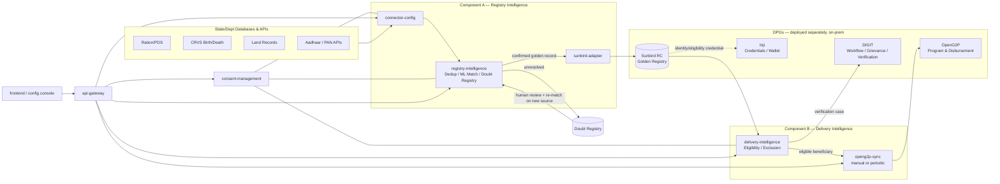

# Social Registry & Delivery of Benefits Platform

A configurable, ML-driven platform for building a **Citizen Social Registry** (golden-record identity resolution across fragmented government databases) and **Delivery of Benefits & Services** (eligibility, exclusion, and disbursement), designed for on-premise, single-tenant deployment per client (state/country).

The platform does **not** reimplement identity, credentialing, or payment infrastructure that Digital Public Goods (DPGs) already provide. It orchestrates them and contributes the two pieces no DPG provides out of the box: **entity-resolution intelligence** for the registry, and **eligibility/exclusion intelligence** for delivery.

## Design principles

1. **Configuration over code** — onboarding a new source database is a config change (schema mapping, connection details, refresh cadence), not a new integration project.
2. **Golden Registry + Doubt Registry, both permanent** — every new source is matched against both. A "doubt" record is never a dead end; it is re-attempted on every subsequent onboarding run and is only ever resolved by a **human in the loop**.
3. **Base ML model + per-client fine-tuning** — a single entity-resolution model ships pre-trained on generalizable matching features (name, DOB, address, family-graph similarity). It improves per deployment using that client's own deterministic matches (Aadhaar-confirmed pairs, etc.) as weak labels, plus human-resolved doubt records as strong labels. No client's data is required to get a working model on day one.
4. **DPGs as pluggable adapters, not forks** — Sunbird RC (registry), Inji (verifiable credentials/wallet), OpenG2P (program & disbursement), DIGIT (workflow/grievance/verification) are integrated via their APIs and run as their own services. This platform never forks them.
5. **On-prem, microservices, API-first** — every component below is an independently deployable service communicating over HTTP APIs, orchestrated via Docker Compose (this repo) or Kubernetes (client-specific overlay, not included here).
6. **Single-tenant per installation** — no cross-client data isolation logic; each deployment is a dedicated instance for one client.

## Component map

### Component A — Building the Registry ("Registry Intelligence")

| Service | Responsibility |
|---|---|
| `connector-config` | No-code source onboarding: register a DB/API/flat-file source, map its fields to the canonical citizen/family schema, set refresh cadence. Drives a generic ingestion engine — no bespoke code per source. |
| `registry-intelligence` | Data standardization, ML entity resolution (deterministic + fuzzy + learned matching), household/family graph clustering, classification (Unique+Complete / Unique+Incomplete / Complete+Not-unique / Neither), and the **Doubt Registry** — the queue of unresolved records with full evidence trail, resolved only by human review. |
| `sunbird-adapter` | Thin adapter between `registry-intelligence`'s confirmed golden records and a **separately deployed Sunbird RC** instance. Kept as its own service so the registry backend (Sunbird RC today) can be swapped without touching matching logic. |

### Component B — Delivery of Benefits ("Delivery Intelligence")

| Service | Responsibility |
|---|---|
| `delivery-intelligence` | Eligibility scoring against scheme rules, inclusion/exclusion logic (duplicate beneficiary, asset/income thresholds), and case creation for on-ground verification (routed to DIGIT) when a Doubt Registry record blocks a benefit decision. |
| `openg2p-sync` | One-way sync of confirmed eligible beneficiaries into a **separately deployed OpenG2P** instance for program enrollment and disbursement. Sync is **manually triggerable or scheduled (periodic)** — deliberately not a live link, so OpenG2P can run with its own local copy for resilience. |
| *(external, not in this repo)* DIGIT | Application intake, verification & field-agent workflow, grievance & appeal. Called via its published APIs. |
| *(external, not in this repo)* Inji | Verifiable-credential issuance (Inji Certify) and verification (Inji Verify) for identity/eligibility proofs presented at service points. |

### Cross-cutting

| Service | Responsibility |
|---|---|
| `consent-management` | DPDP Act–aligned consent capture, purpose limitation, revocation, and audit trail for every data-sharing action between a source system, the registry, and delivery. |
| `api-gateway` | Single entry point routing `/api/<service>/*` to each backend microservice; where the frontend and any external caller connect. |
| `frontend` | Configuration console — the operator-facing UI for connectors, registry/doubt-registry review, consent, delivery rules, and OpenG2P sync triggers. |

## Architecture



## Repository layout

```
socialregistrymine/
├── docker-compose.yml          # local/on-prem orchestration of this repo's services
├── services/
│   ├── consent-management/     # fully implemented — DPDP consent capture & audit
│   ├── connector-config/       # source onboarding config API (scaffold)
│   ├── registry-intelligence/  # matching engine + Golden/Doubt registry (scaffold)
│   ├── delivery-intelligence/  # eligibility/exclusion engine (scaffold)
│   ├── openg2p-sync/           # manual/periodic sync trigger to OpenG2P (scaffold)
│   ├── sunbird-adapter/        # adapter to a separately-deployed Sunbird RC (scaffold)
│   └── api-gateway/            # routing layer
├── frontend/                   # React + TypeScript + Tailwind config console
└── docs/
    └── architecture.md
```

Each service scaffold exposes a real, runnable FastAPI app with a documented API contract (`/docs`), so the shape of the platform is executable from day one even before matching/eligibility logic is filled in. `consent-management` is the one fully built out this phase, per the current build priority.

## Running locally

```bash
docker compose up --build
```

- API Gateway: http://localhost:8000
- Frontend: http://localhost:5173
- Each service's OpenAPI docs: http://localhost:<service-port>/docs

## Status

This is the initial scaffold: architecture, service boundaries, and the consent-management service are implemented. Registry matching (ML entity resolution), delivery eligibility rules, and the Sunbird RC / OpenG2P / DIGIT / Inji adapters are stubbed with their intended API contracts and are the next build phases.
